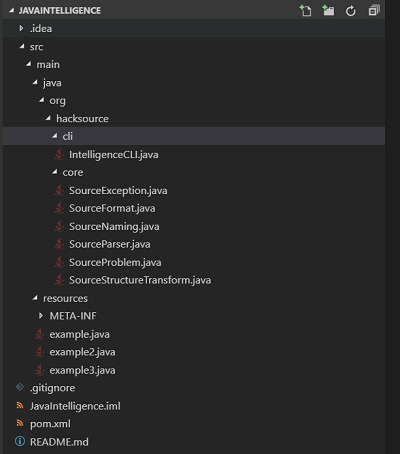
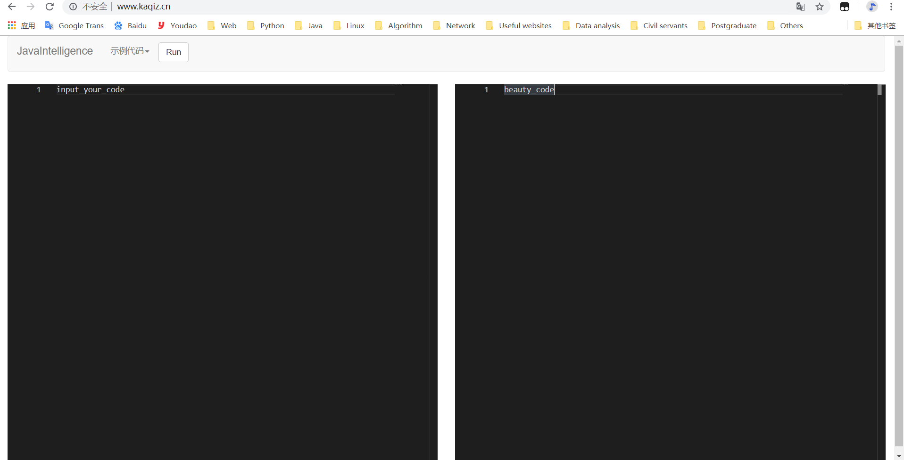
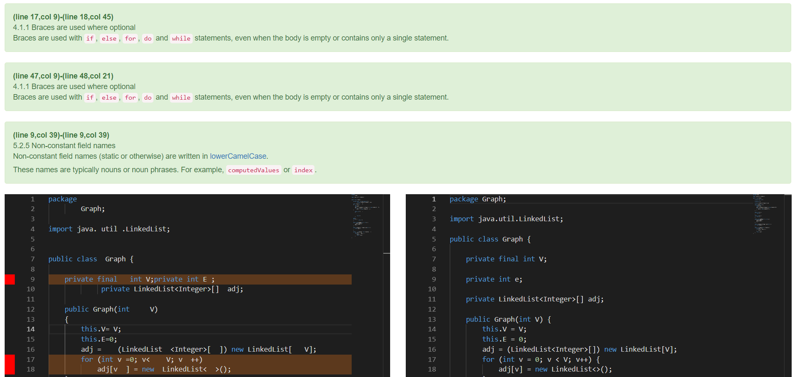
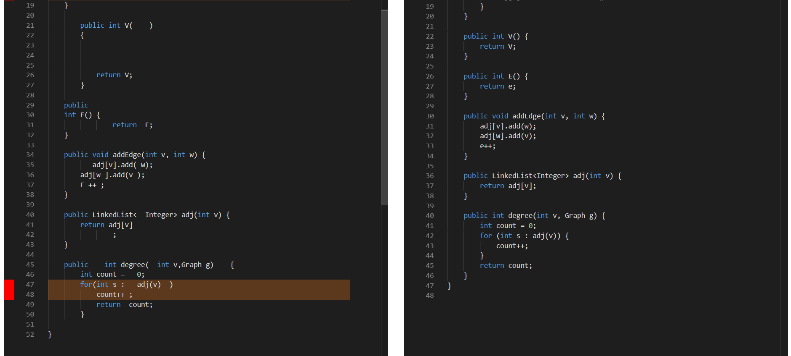
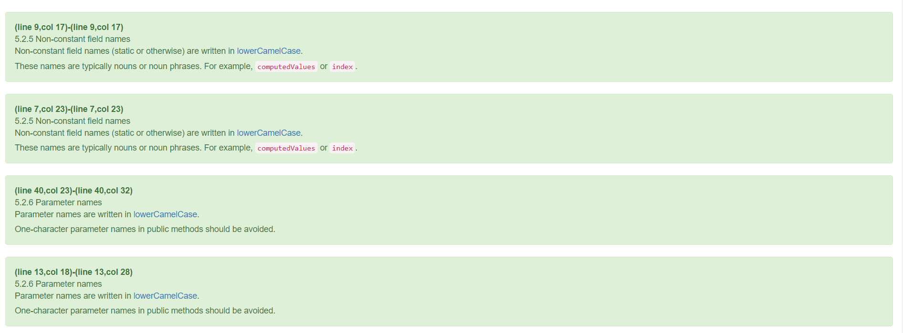
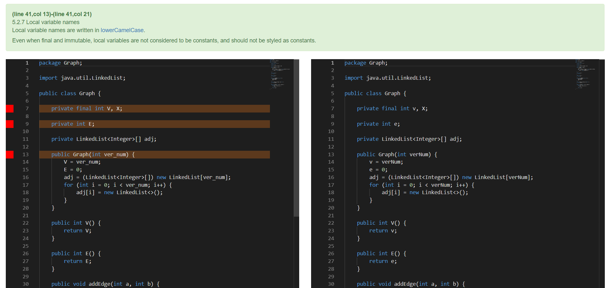
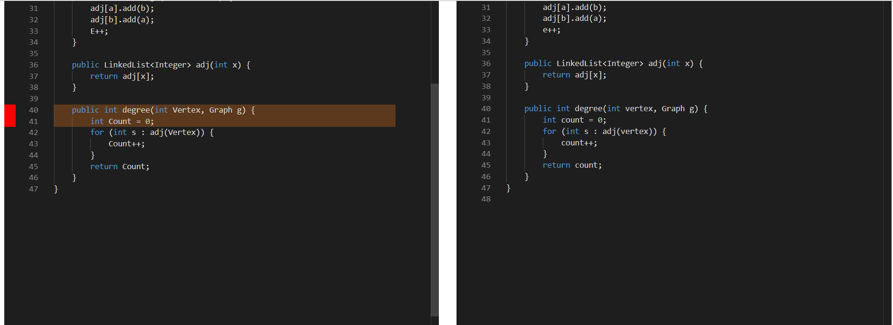
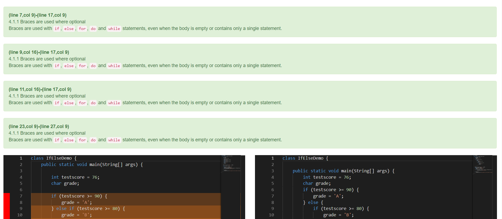
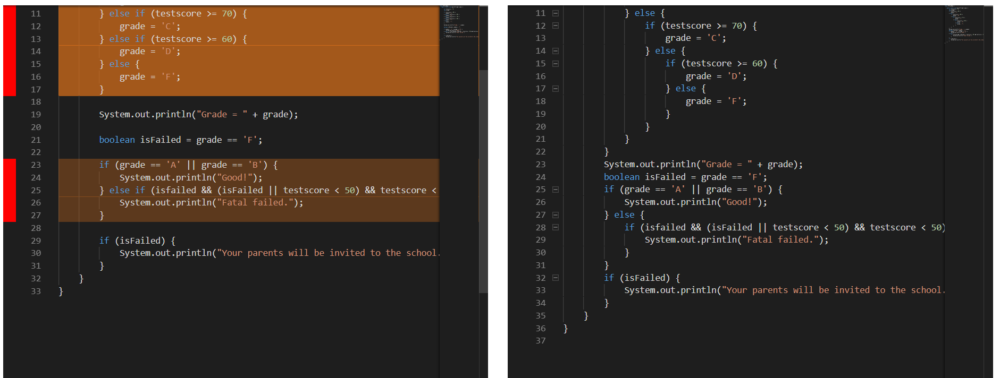

# JavaIntelligence
*give some intelligence to your java code*

### 一、简介

**JavaIntelligence - 基于抽象语法树与符号解析的 Java 代码静态分析/重构工具**

本项目对Java语言代码进行重构，实现代码格式重构，特定类型命名重构，等价语句互转以及程序正确性性检测及自动修复，正确率均达到99%以上

#### 开发环境：

- 算法部分
    - IntelliJ IDEA
    - VSCode

- 展示部分
    - PyCharm

- 多人协作
    - Git
    - Gogs
    - GitHub

#### 技术梗概：
- 算法部分
    - Maven
    - JDK 1.8
    - JavaParser
    - JavaSymbolSolver

- 展示部分
    - 后端
        - Django
    - 前端
        - Bootstrap
        - Monaco Editor
        - AJAX

### 二、目录介绍

| 描述 | 目录 |
| ---- | ---- |
| 命令行交互 | src/main/java/org/hacksource/cli |
| 核心算法 | src/main/java/org/hacksource/core |
| 测试资源 | src/main/resources |

*注：单元测试未独立成类，而是写在核心算法内*

### 三、快速开始

#### 在线环境（推荐）
进入 https://www.kaqiz.cn 即可使用

注：
- 第一次加载可能较慢，请耐心等待
- 代码必须是一个完整的 java 文件，而不能是一个代码段，如一个赋值语句等（这是因为只有完整的代码段才能由符号分析器推导出变量类型及其依赖关系）

如图所示，左面输入代码，点击 Run 后，右边则给出重构后的代码，前端本身提供了几个示例代码（下拉列表框“实例代码”处）

#### 本机搭建
1. 使用 Maven 或打开 IntelliJ IDEA 构建项目，生成 jar 包
1. 如果不想搭建 Web 在线平台，则可直接运行 jar 包（注：主类为 `org.hacksource.cli.IntelligenceCLI`），而后在标准输入中输入代码，得到返回的 json 数据（不太直观，推荐通过 Web 平台查看可视化结果）；若想搭建 Web 平台则按照下面的步骤
1. 将在 web 目录下的 django 项目部署到本机或服务器上，运行此项目

### 四、测试

**测试代码与运行结果截图**

**测试1（代码格式重构）：**

如上图所示，左面为输入的测试代码，右边为运行后重构的代码，运行后会将代码不规范的地方高亮显示，并定位到具体格式有问题的行与列，在最上方给出具体的规范说明（部分空行，空格只进行更正不进行高亮提示以及规范说明）。重构后，正确率在99%以上，包括不得省略花括号、换行、空白、表达式圆括号等。

**测试2（特定类型命名重构）：**

如上图所示，对于命名不规范（不遵循lowerCamelCase）的变量，运行后，定位到命名不规范变量的位置并高亮显示，在上方给出具体的分析说明，右边则为重构后的代码。重构后，命名正确率在99%以上，包括：包命名，类命名，方法命名，常量命名，成员变量命名，参数命名，局部变量命名等。

**测试3（等价语句互转）：**

如上图所示，根据给定的代码规范，对于多条件单if语句/单条件多if互转语句，for/while互转，多if/switch互转等，实现不满足结构规范的代码，对其结构自动重构，会将代码不规范的地方高亮显示，并定位到结构规范有问题的行与列，在最上方给出具体的规范说明，重构后，结构正确率在99%以上。

### 五、开发者

- 静态分析/重构算法: @PragmaTwice(负责人) @kaqiz @coderigenius
- Web前后端: @kaqiz(负责人) @PragmaTwice
- 文档: @guido-miracle @PragmaTwice

### 六、总结讨论

本项目对Java语言代码进行重构，对于不规范代码的位置进行定位并高亮显示，给出详细的分析说明，并进行代码重构，达到很高的正确率。采用前端平台进行展示，方便快捷。实现了代码格式重构（重构后正确率需在99%以上）、特定类型命名重构（重构后命名正确率需在99%以上）、等价语句互转（重构后结构正确率需在99%以上）以及程序正确性性检测及自动修复等。
